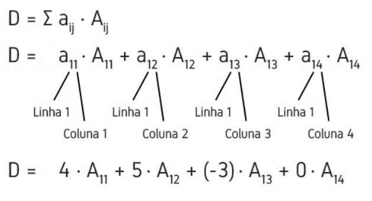

# Cálculo da Determinante usando MPI
<b>

Bruna Mayumi Kimura

Engenharia de Computação - Insper

</b>

-------------------------------

## Introdução

Este projeto consiste em calcular a determinante de uma determinada matriz de froma distribuída. Para tanto foi utilizado as funções do MPI. Além disso, foi feita uma análise de desempenho sobre os modelos.

## Cálculo da Determinante

O código com apenas o cálculo da determinante pode ser encontrado no arquivo `Tarefa.cpp`. Nele é possível ver a implementação do algoritmo em C++.

O cálculo da determinante foi feito utilizando o teorema de Laplace. Este cálculo consiste em reduzir a matriz até um tamanho que seja conhecido a determinantes. Para tanto, é necessário escolher uma linha que será eliminada e fazer o cálculo segundo a fórmula abaixo.

Sendo que 'A' é o cofator da matriz e é dado pela equação abaixo.

Aij = (-1)^(i + j) * Dij

No caso deste algoritmo o cálculo foi feito utilizando recursão a fim de diminuir a matriz até chegar no caso base, uma matriz de 1x1. Neste caso, a determinante é o próprio valor da matriz. A cada passo da recursão a matriz é reescrita para um tamanho menor, ou seja, de 5x5 é reduzida para 4x4, em seguida para 3x3, sucessivamente até chegar ao caso base. O retorno da função é utilizada na fórmula acima e assim, somando os resultados tem-se a determinante.

## Distribuindo na memória

Para a distribuição da memória, utilizou-se o MPI. A implementação do algoritmo foi escrita em C++ e pode ser encontrado no arquivo `Tarefa_MPI.cpp`.

A ideia foi distribuir a equação 'D' mostrada pela imagem. Ou seja, distribuir a multiplicação do valor da matriz com seu cofator.

Para tanto, utilizou-se um processo mestre para enviar a matriz e seu tamanho para os processos servos. Esse envio de dados foi feito utilizando a função _broadcast_.  Assim, um mesmo dado é enviado para todos os processos servos.

O segundo passo foi dividir os cálculos entre os processos servos. Neste caso o cálculo é dividio apenas em dois processos filhos. Sendo assim, metade dos cálculos vai para o processo 1 e a outra metade para o processo 2.

Quando os processos retornam os resultaados obtidos, o próximo passo é somá-los, a fim de obter a determinante da mariz. Para tanto, utilizou-se a função _reduce_. Essa função tem como objetivo juntar os dados com alguma operação, neste caso somando-os.

Por fim, o processo mestre _printa_ o valor da soma, ou seja, a determinante.

## Modo de uso

Para digitar a matriz a ser calculada a determinante é necessário alterar o código. Basta alterar a região mostrada abaixo.

Sendo que, o _n_ é o tamanho da matriz (lembrando que é uma matriz quadrada, ou seja, Matriz[n][n]) e os valores da matriz são separado por vírgulas.

Para executar apenas o cálculo da determinante sem distribuição, basta compilá-lo normalmente, como mostrado abaixo.

`g++ -o Tarefa.cpp Tarefa`

Esse comando irá gerar o executável `Tarefa`. Para rodar o programa basta digitar o seguinte comando:

`./Tarefa`

Assim, o programa irá printar o valor da determinante. E o tempo decorrido.

Já para fazer a distribuíção, é necessário compilar o arquivo `Tarefa_MPI.cpp` da segunte forma:

`mpic++ Tarefa_MPI.cpp -o Tarefa_MPI`

Que irá gerar um executável `Tarefa_MPI`, e para executar o programa é necessário digitar:

`mpirun -n 3 ./Tarefa_MPI`

Onde o número é a quantidade de processos, incluindo a mestra.

## Desempenho

Para o cálculo do desempenho, foi medido o tempo de execução de cada código com diversos tamanho de matrizes. A função utilizada para marcar o tempo foi a biblioteca `<time.h>`. O tempo foi marcado logo antes de começar o cálculo e finalizado ao terminar de fazer a somatória da determinante.

O cálculo foi feito para matrizes de 5x5 à 10x10. O gráfico de tempo por tamanho com resultado pode ser visto abaixo.

O eixo y é o tempo gasto na execução, já o eixo x tráz o tamanho da matriz executada. A linha azul é o calculo da matriz simples e a linha vermelha é a execução com o código distribuido. 

## Conclusão

É possível notar que não houve uma grande diferença na execução dos dois métodos. Para matrizes de tamanho menor ocorre uma diferença um pouco maior em comparação ao seu desempenho em marizes maiores. Ambos os códigos aumentam o tempo logaritmicamente.

Para matrizes menores o tempo de execussão foi bastante baixo, quase insignificante. Enquanto para matrizes maiores que 10 a execussão ficou muito lenta não sendo possível fazer a análise, uma vez, que não deu tempo de executá-las.

Utilizar a distribuição é bastante interessante, porém neste caso onde dividiu-se apenas em dois processos não houveram grandes ganhos de desempenhos. Talvez, com matrizes maiores e com mais processos o resultado teria sido bastante surpreendente.

## Melhorias futuras

Como melhoria futuras seria interessante poder separar o código em mais de dois processos. E distribuir os cálculos dinamicamente, dependendo da demanda. 

Outro ponto que pode ser melhorado é como é passado a matriz. Ao invés de digitá-la manualmente diretamente no código, ela poderia ser passada por linha de comando, com um input, ou logo na entrada da execução do código. Ou poderia até mesmo ler um arquivo com as matrizes.